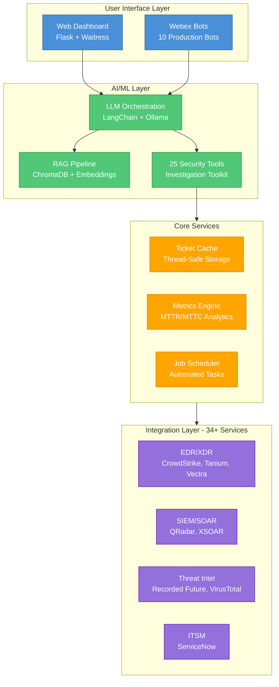
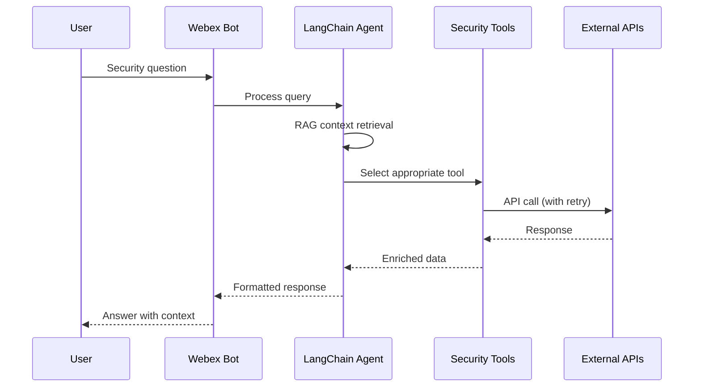

# Security Operations Automation Platform

A comprehensive, enterprise-grade security operations automation platform featuring 34+ service integrations, LLM-powered security assistants, self-healing Webex bots, 35 n8n automation workflows, and real-time SOC dashboards.

[](https://github.com/vinayvobbili/security-ops-platform/actions/workflows/ci.yml)
[](https://www.python.org/downloads/)
[](https://opensource.org/licenses/MIT)
[](https://github.com/psf/black)
[](https://github.com/PyCQA/bandit)
[](https://pycqa.github.io/isort/)

---

## Overview

This platform automates and orchestrates security operations workflows, providing:
- **LLM-Powered Security Assistant** with 25 specialized investigation tools
- **10 Production Webex Bots** with self-healing WebSocket architecture
- **34+ Security Tool Integrations** (CrowdStrike, Tanium, QRadar, ServiceNow, etc.)
- **35 n8n Automation Workflows** for alerting, enrichment, hunting, and response
- **Real-time SOC Dashboards** with metrics, ticket aging, and trend analysis
- **Domain Threat Monitoring** with multi-source correlation
- **LLM-Powered Threat Intel Analysis** with automated IOC hunting

---

## Key Features

### LLM-Powered Security Assistant

AI-powered security investigation using RAG (Retrieval-Augmented Generation):

| Tool | Description |
|------|-------------|
| CrowdStrike Tools | Host lookup, detection search, containment actions, RTR sessions |
| QRadar Tools | Log search, offense investigation, AQL queries |
| Recorded Future | Threat intelligence, IOC enrichment, risk scoring |
| VirusTotal | Hash/URL/domain reputation analysis |
| ServiceNow | Asset lookup, ticket creation, CMDB queries |
| Tanium | Endpoint status, live queries, tag management |
| DFIR-IRIS | Case creation, IOC management, timeline events |
| TheHive | Case management, observable tracking |
| XSOAR | Ticket enrichment and summary generation |
| Tipper Analysis | LLM-powered threat intel novelty detection |
| Remediation | Automated playbook and runbook suggestions |
| Shodan | Internet-facing asset discovery |
| AbuseIPDB / Abuse.ch | IP reputation, malware hash and C2 feed lookups |
| HIBP | Credential breach checking |
| + 11 more tools | Full investigation toolkit |

### Self-Healing Webex Bots

Production-grade bot architecture with enterprise reliability:

```
┌─────────────────────────────────────────────────────────────┐
│                    Bot Resilience Layer                      │
│  ┌──────────────┐  ┌──────────────┐  ┌──────────────┐      │
│  │ WebSocket    │  │ Connection   │  │ Auto         │      │
│  │ Keep-alive   │  │ Pooling      │  │ Reconnect    │      │
│  └──────────────┘  └──────────────┘  └──────────────┘      │
│  ┌──────────────┐  ┌──────────────┐  ┌──────────────┐      │
│  │ Exponential  │  │ Health       │  │ Graceful     │      │
│  │ Backoff      │  │ Monitoring   │  │ Degradation  │      │
│  └──────────────┘  └──────────────┘  └──────────────┘      │
└─────────────────────────────────────────────────────────────┘
```

**Available Bots:**
- `pokedex` / `hal9000` - LLM-powered security assistants
- `toodles` - Team collaboration and notifications
- `jarvis` - Automated security workflows
- `msoar` - XSOAR integration bot
- `barnacles` - Metrics and reporting
- `tars` / `money_ball` / `case` - Specialized operations

### Security Platform Integrations (34+)

| Category | Integrations |
|----------|-------------|
| **EDR/XDR** | CrowdStrike Falcon (+ RTR), Tanium (Cloud & On-Prem), Vectra |
| **SIEM** | IBM QRadar |
| **SOAR** | Cortex XSOAR, Custom Playbooks |
| **Case Management** | DFIR-IRIS, TheHive |
| **Threat Intel** | Recorded Future, VirusTotal, URLScan, AbuseIPDB, Abuse.ch, IntelX, Shodan |
| **Email Security** | Abnormal Security, Zscaler |
| **ITSM** | ServiceNow (CMDB, Incidents, Changes) |
| **Identity** | Have I Been Pwned (HIBP) |
| **Domain Security** | Certificate Transparency (Censys, CertStream), WHOIS, Domain Lookalike Detection |
| **Dark Web** | IntelligenceX, PhishFort |
| **DevOps** | Azure DevOps |
| **Communication** | Webex, Email (OAuth2), Twilio SMS |

### Real-Time SOC Dashboard

Flask-based web application with interactive visualizations:

- **Ticket Aging Analysis** - Track incident lifecycle and SLA compliance
- **MTTR/MTTC Metrics** - Mean time to respond and close trending
- **Volume Analytics** - Alert inflow/outflow patterns
- **Detection Efficacy** - Rule performance and noise analysis
- **Shift Performance** - Team and analyst productivity metrics
- **EPP Tagging Metrics** - Endpoint protection coverage

### n8n Workflow Automation (35 Workflows)

Ready-to-import automation workflows covering the full SOC lifecycle:

| Category | Workflows | Examples |
|----------|-----------|---------|
| **Alert & Detection** | 6 | CrowdStrike/QRadar/Vectra alerts to Webex, alert deduplication |
| **Incident Response** | 5 | Smart escalation, war room creation, cross-system correlation |
| **Threat Intelligence** | 6 | IOC sync, dark web monitoring, phishing URL analysis |
| **Threat Hunting** | 3 | Scheduled hunt queries, detection rule testing, CVE alerts |
| **XSOAR & Ticketing** | 4 | Ticket enrichment, SLA risk escalation, shift handoff reports |
| **Asset Management** | 6 | Tanium inventory, CMDB sync, EPP tagging, offboarding checks |
| **Network Security** | 2 | Zscaler URL blocking, URLhaus auto-block |
| **Reporting** | 3 | Daily SOC metrics, ticket aging, on-call management |

### Domain Threat Monitoring

Multi-source domain monitoring with automated correlation:

- **Certificate Transparency** - Censys API and CertStream real-time monitoring
- **Domain Lookalike Detection** - Typosquat and brand impersonation with Recorded Future enrichment
- **WHOIS Monitoring** - Registration change tracking
- **Dark Web Monitoring** - Data leak detection via IntelligenceX
- **Abuse Feed Correlation** - Abuse.ch, AbuseIPDB, Shodan, HIBP, VirusTotal enrichment
- **Automated Alerting** - Webex notifications with severity-based routing

### Tipper Analyzer

LLM-powered threat intelligence analysis engine:

- Evaluates threat intel reports for novelty against historical data
- Hunts extracted IOCs across CrowdStrike, QRadar, and Abnormal Security
- Integrates with Azure DevOps for case tracking
- CLI interface for ad-hoc and scheduled analysis

---

## Architecture



### Data Flow



---

## Project Structure

```
.
├── services/               # 34+ API client integrations
│   ├── crowdstrike.py     # CrowdStrike Falcon EDR
│   ├── crowdstrike_rtr.py # CrowdStrike Remote Terminal Response
│   ├── tanium.py          # Tanium endpoint management
│   ├── qradar.py          # IBM QRadar SIEM
│   ├── dfir_iris.py       # DFIR-IRIS case management
│   ├── thehive.py         # TheHive case management
│   ├── domain_lookalike.py # Typosquat detection
│   ├── domain_monitor.py  # Multi-source domain monitoring
│   ├── cert_transparency.py # Certificate transparency
│   ├── xsoar/             # Cortex XSOAR client
│   └── ...                # 24+ more integrations
│
├── webex_bots/            # 10 production Webex bots
│   ├── pokedex.py         # LLM security assistant
│   ├── hal9000.py         # Detection engineering assistant
│   ├── toodles.py         # Incident response orchestration
│   └── ...                # 7 more specialized bots
│
├── my_bot/                # LLM/RAG implementation
│   ├── tools/             # 25 security investigation tools
│   ├── core/              # LLM orchestration
│   └── document/          # RAG document processing
│
├── n8n_workflows/         # 35 automation workflow templates
│   ├── crowdstrike_webex_alerts.json
│   ├── threat_intel_ioc_sync.json
│   ├── incident_escalation.json
│   └── ...                # 32 more workflows
│
├── src/
│   ├── components/        # Business logic modules
│   │   ├── tipper_analyzer/   # LLM threat intel analysis
│   │   ├── domain_monitoring/ # Multi-source domain monitoring
│   │   └── web/              # Web route handlers
│   ├── secops/            # SOC operations modules
│   └── utils/             # Shared utilities
│
├── web/                   # Flask web application
│   ├── routes/            # API endpoints
│   ├── templates/         # HTML templates
│   └── static/            # CSS, JavaScript
│
├── deployment/            # Production deployment
│   ├── systemd/           # 20+ systemd service files
│   ├── bot_status_api.py  # REST API for bot management
│   └── log_viewer.py      # Real-time log viewing
│
├── tests/                 # pytest test suite
├── .github/workflows/     # CI/CD pipeline
└── Dockerfile             # Container deployment
```

---

## Quick Start

### Prerequisites

- Python 3.8+
- API credentials for integrated platforms
- Webex Bot tokens (for bot functionality)

### Installation

```bash
# Clone the repository
git clone https://github.com/vinayvobbili/security-ops-platform.git
cd security-ops-platform

# Create virtual environment
python3 -m venv .venv
source .venv/bin/activate

# Install dependencies
pip install -r requirements.txt

# Copy sample environment file
cp data/samples/.env.sample .env
# Edit .env with your API credentials
```

### Running Components

```bash
# Start web dashboard
python web/web_server.py
# Access at http://localhost:5000

# Start LLM-powered bot
python webex_bots/pokedex.py

# Start all scheduled jobs
./startup_scripts/start_all_jobs.sh

# Run tests
pytest tests/ -v
```

### Docker Deployment

```bash
# Build image
docker build -t security-ops-platform .

# Run container
docker run -d -p 5000:5000 --env-file .env security-ops-platform
```

---

## Technical Highlights

### Enterprise Reliability Patterns

- **Retry with Exponential Backoff** - Configurable retry logic with jitter
- **Connection Pooling** - HTTP session reuse (60 max connections)
- **Circuit Breakers** - Graceful degradation on service failures
- **Thread-Safe Token Management** - File locking for OAuth token refresh
- **Atomic File Operations** - Write-to-temp + rename pattern

### Security Best Practices

- **OAuth2 Token Management** - Secure token caching and refresh
- **SSL/TLS Handling** - Certificate chain bundling for proxies
- **Encrypted Secrets** - Age encryption for sensitive configuration
- **API Rate Limiting** - Intelligent throttling (429 handling)

### Observability

- **Structured Logging** - Module-level filtering, rotation
- **Health Endpoints** - Readiness and liveness checks
- **Metrics Collection** - Performance tracking and SLA monitoring

---

## Testing

```bash
# Run all tests
pytest tests/ -v

# Run with coverage
pytest tests/ -v --cov=src --cov=services --cov-report=term-missing

# Run specific test category
pytest tests/ -v -k "test_services"
```

Test coverage includes:
- Service client mocking and error handling
- Retry logic and backoff calculations
- Component integration tests
- Bot command parsing

---

## CI/CD Pipeline

GitHub Actions workflow (`.github/workflows/ci.yml`) includes:
- **Linting** - Black, flake8, isort, mypy
- **Testing** - pytest with coverage reporting
- **Security** - Bandit security linter, dependency vulnerability scanning
- **Build Verification** - Module import validation

---

## Documentation

- [CONTRIBUTING.md](CONTRIBUTING.md) - Development guidelines
- [SECURITY.md](SECURITY.md) - Security policy and best practices
- [docs/AGENTS.md](docs/AGENTS.md) - AI assistant configuration

## Development

```bash
# Using Makefile (recommended)
make help              # Show all available commands
make install-dev       # Install with dev dependencies
make test              # Run tests
make lint              # Run linters
make format            # Format code
make security          # Run security scans
make check             # Run all checks
```

---

## License

This project is licensed under the MIT License - see [LICENSE](LICENSE) for details.

---

## Author

**Vinay Vobbilichetty** - Security Automation Engineer

Specializing in SOAR platform development, incident response automation, and LLM-powered security tools. MS in Computer Science (Cybersecurity track) from NC State University (May 2025).

- [LinkedIn](https://linkedin.com/in/vinay-vobbilichetty)
- [GitHub](https://github.com/vinayvobbili)

---

*Built with Python, Flask, LangChain, and enterprise-grade reliability patterns. Designed for production SOC environments.*
